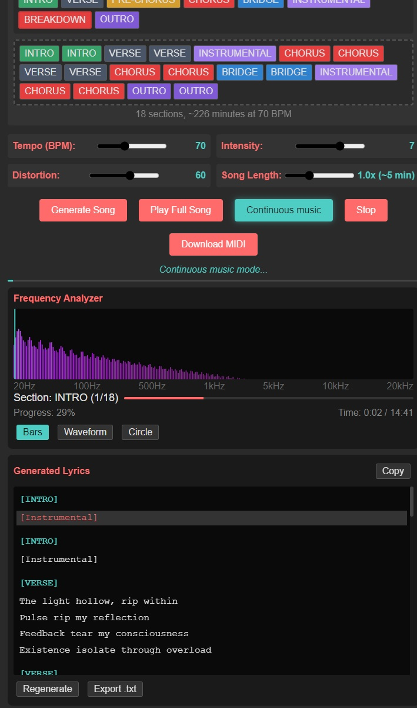

# JsTechnoProducer - Industrial MIDI Song Creator

## Demo Visual




## Demo Track

[Play Song](Assets/song.mid)

## Overview

JsTechnoProducer is a web-based application that generates industrial/techno MIDI songs with customizable parameters. This tool allows musicians and producers to quickly create industrial-style MIDI compositions that can be imported into digital audio workstations (DAWs) for further production.

## Features

### Core Functionality
- **Real-time MIDI Generation**: Create complete MIDI songs with multiple tracks instantly
- **Full Song Playback**: Listen to the entire song directly in the browser using Web Audio API
- **Drag & Drop Song Builder**: Visually arrange song sections with intuitive drag-and-drop interface
- **Customizable Song Structure**: Choose presets or build completely custom arrangements
- **Parameter Control**: Adjust tempo, intensity, distortion, and song length
- **Multi-track Output**: Generates bass and lead tracks with complex time signatures
- **Randomization**: Each generated song is unique with seed-based variations

### User Interface
- **Dark Industrial Theme**: Visually appealing dark interface matching the industrial music aesthetic
- **Real-time Visual Feedback**: See the song structure and playback progress
- **Responsive Controls**: Sliders and dropdowns for intuitive parameter adjustment
- **Section Visualization**: Color-coded display of song sections (intro, verse, chorus, bridge, outro)

## Technical Details

### Technologies Used
- **Pure JavaScript**: No external dependencies or frameworks required
- **Web Audio API**: For real-time audio synthesis and playback
- **MIDI File Format**: Generates standard MIDI files compatible with all major DAWs
- **HTML5/CSS3**: Modern web standards for the interface

### MIDI Implementation
The application generates Type 1 MIDI files with:
- **Track 1**: Tempo and time signature information
- **Track 2**: Bass/rhythm track using Synth Bass 1 (Program 38)
- **Track 3**: Lead/melody track using Synth Lead (Program 80)

### Song Structure Options
1. **Standard**: Intro → Verse → Chorus → Verse → Chorus → Bridge → Chorus → Outro
2. **Simple**: Verse → Chorus → Verse → Chorus
3. **Extended**: Extended version with double choruses for longer compositions
4. **Industrial**: Atmospheric with extended intro/outro sections

### Audio Synthesis
The full song playback uses Web Audio API to create:
- **Sawtooth waves** for bass sounds with adjustable distortion
- **Square waves** for lead sounds with low-pass filtering
- **Dynamic gain control** based on intensity settings
- **Section-specific frequency patterns** for musical variation
- **Complete song structure** with all sections played in sequence

## Parameters

### Tempo (BPM)
- **Range**: 60-140 BPM
- **Default**: 85 BPM
- **Description**: Controls the speed of the song. Lower values create slower, more atmospheric tracks while higher values create more energetic compositions.

### Intensity
- **Range**: 1-10
- **Default**: 7
- **Description**: Affects the velocity of MIDI notes and the volume/filtering of the preview. Higher intensity creates more aggressive, louder sounds.

### Distortion
- **Range**: 0-100
- **Default**: 60
- **Description**: Applies waveshaping distortion to the bass sounds during preview. Higher values create more industrial, gritty textures.

## Quick Start

### Running the Application

1. **Clone the repository** (if you haven't already):
   ```bash
   git clone https://github.com/cschladetsch/JsTechnoProducer.git
   cd JsTechnoProducer
   ```

2. **Open the application** in your web browser:
   ```bash
   # On Linux:
   xdg-open IndustrialMIDICreator.html
   
   # On macOS:
   open IndustrialMIDICreator.html
   
   # On Windows:
   start IndustrialMIDICreator.html
   ```

   Or simply double-click the `IndustrialMIDICreator.html` file in your file manager.

### Using the Application

1. **Adjust Parameters**:
   - **Tempo (BPM)**: 60-140 (default: 85)
   - **Intensity**: 1-10 (default: 7) - Controls note velocity and filter cutoff
   - **Distortion**: 0-100 (default: 60) - Applies waveshaping to bass sounds
   - **Song Length**: 0.5x-2x (default: 1x) - Multiplier for ~5 minute base length

2. **Create Song Structure (NEW: Drag & Drop Interface)**:
   - **Preset Buttons**: Click Standard, Simple, Extended, or Industrial to load preset structures
   - **Drag Sections**: Drag sections from the palette to build custom song structures
   - **Reorder**: Drag sections within the structure editor to reorder them
   - **Remove**: Hover over a section and click the × button to remove it
   - **Available Sections**:
     - INTRO - Atmospheric opening
     - VERSE - Main melodic sections
     - PRE-CHORUS - Build-up sections
     - CHORUS - High-energy hooks
     - BRIDGE - Contrasting middle sections
     - INSTRUMENTAL - Instrumental breaks
     - BREAKDOWN - Heavy rhythmic sections
     - OUTRO - Closing sections

3. **Generate and Play**:
   - Click **"Generate Song"** to create the MIDI data
   - Click **"Play Full Song"** to hear the complete track in your browser
   - Click **"Stop"** to stop playback at any time
   - Click **"Download MIDI"** to save the .mid file

### NIN "The Day The World Went Away" Style Settings

For a Nine Inch Nails industrial sound:
- **Tempo**: 92 BPM
- **Intensity**: 8-9
- **Distortion**: 75-80
- **Structure**: Industrial

## File Structure

```
JsTheDayTheWoldWentAway/
├── Readme                        # Brief project identifier
├── Readme.md                     # This comprehensive documentation
├── main.js                       # Main application file (HTML/CSS/JavaScript)
├── IndustrialMIDICreator.html    # Clean standalone version
└── IndustrialMIDICreator_files/  # Related web assets
```

## Playing MIDI Files

### Option 1: Web Browser (Built-in)
The application includes full Web Audio synthesis. Just click "Play Full Song" after generating.

### Option 2: VLC Media Player
VLC requires a soundfont to play MIDI files:
```bash
# Install FluidSynth and soundfont
sudo apt install fluidsynth fluid-soundfont-gm

# Then open the MIDI file in VLC
vlc industrial_song.mid
```

### Option 3: TiMidity++ (Recommended for Linux)
```bash
# Install TiMidity++
sudo apt install timidity timidity-interfaces-extra

# Play the MIDI file
timidity industrial_song.mid
```

### Option 4: Digital Audio Workstation (Best Quality)
Import the MIDI into a DAW for professional results:

**Free DAWs:**
- **LMMS**: `sudo apt install lmms`
- **Ardour**: `sudo apt install ardour`
- **Tracktion Waveform**: Free version available

**Commercial DAWs:**
- Ableton Live
- FL Studio
- Logic Pro (Mac)
- Reaper (60-day trial)

## Browser Compatibility

The application requires a modern web browser with support for:
- Web Audio API
- Blob API
- ES6 JavaScript features

Tested and confirmed working on:
- Chrome 90+
- Firefox 88+
- Safari 14+
- Edge 90+

## Troubleshooting

### No Sound During Playback
1. Check your system volume
2. Ensure your browser allows audio playback (click elsewhere on the page first)
3. Try a different browser

### MIDI File Won't Play in Media Player
- Install a soundfont (see "Playing MIDI Files" section above)
- Use a dedicated MIDI player or DAW
- Try the built-in web playback instead

### Browser Issues
- Clear browser cache
- Disable ad blockers for local files
- Make sure JavaScript is enabled

## Musical Theory

### Scale and Harmony
The generator uses minor pentatonic scales and power chord progressions typical of industrial music:
- Root notes centered around E (82.41 Hz)
- Harmonics at perfect fifths and octaves
- Chromatic passing tones in bridge sections

### Rhythm Patterns
- **Verse**: Steady eighth-note patterns with syncopated accents
- **Chorus**: More aggressive sixteenth-note patterns
- **Bridge**: Slower, atmospheric whole notes
- **Intro/Outro**: Sparse patterns for tension building/release

## Future Enhancements

Potential improvements for future versions:
- Additional instrument tracks (drums, pads, effects)
- Custom pattern editor
- More synthesis parameters (filter envelope, LFO)
- MIDI CC automation data
- Export to other formats (WAV, MP3)
- Pattern randomization options
- Key signature selection
- Time signature variations

## License and Usage

This tool is designed for creative music production. Generated MIDI files can be used freely in your productions. The application itself should be used in accordance with any licensing terms provided by the original developers.

## Troubleshooting

### Common Issues

1. **No Sound During Preview**
   - Ensure your browser allows audio playback
   - Check system volume settings
   - Try clicking elsewhere on the page first (some browsers require user interaction)

2. **MIDI File Won't Download**
   - Check browser download settings
   - Ensure pop-up blockers aren't preventing the download
   - Try a different browser if issues persist

3. **Playback Stuttering**
   - Close other browser tabs to free up resources
   - Lower the intensity parameter
   - Try a simpler song structure

## Technical Notes

The application generates MIDI data in real-time using bitwise operations to create proper MIDI byte sequences. The Web Audio API implementation uses oscillators, filters, and gain nodes to approximate the sound of classic industrial synthesizers. The distortion algorithm uses a waveshaping technique that emulates analog distortion circuits.

## License

This project is licensed under the MIT License - see the [LICENSE](LICENSE) file for details.
